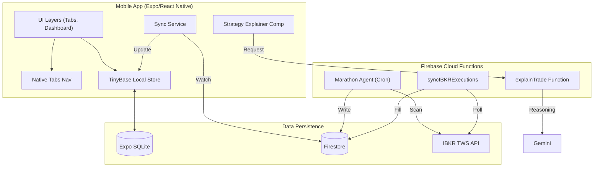
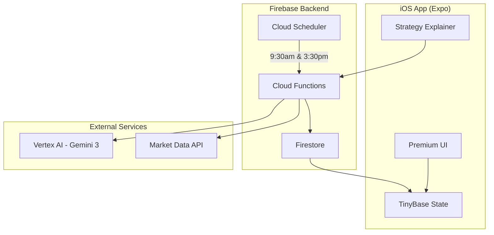
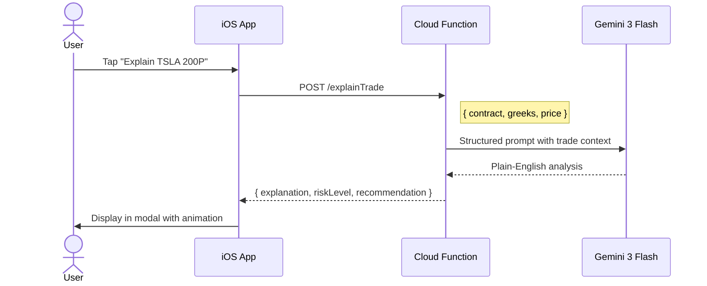
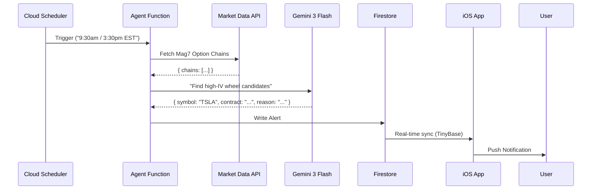

# Wheel Strat Architecture & Data Flow


**System Design for the "Marathon Agent" & iOS Trading Assistant**

## 1. System Overview

**Wheel Strat** is a local-first, AI-powered mobile app designed to orchestrate "The Wheel" trading strategy. The system is built around two core Gemini 3 features:

1. **Strategy Explainer**: On-demand AI analysis of any option trade
2. **Marathon Agent**: Scheduled market scans that push actionable alerts



## 2. Gemini 3 Integration Points

### A. Strategy Explainer (User-Initiated)

**Purpose**: Transform complex options data into actionable insights.

**Flow**:


**Why Gemini 3?**
- **Enhanced reasoning**: Evaluates multi-factor risk (delta, theta decay, IV rank) in a single inference
- **Low latency**: Sub-second responses for real-time UX
- **Structured output**: Reliable JSON extraction for UI rendering

### B. Marathon Agent (Scheduled)

**Purpose**: Autonomous market monitoring that alerts users to opportunities.

**Schedule**: 
- **Market Open**: 9:30 AM EST
- **Market Close**: 3:30 PM EST

**Flow**:


**Prompt Strategy**:
```
You are a "Wheel Strategy" scanner. Analyze these option chains:
- Identify puts with delta between -0.25 and -0.35
- Prioritize IV Rank > 50%
- Target 30-45 DTE expiration

Return the single best candidate with reasoning.
```

## 3. Technology Stack

| Layer | Technology | Purpose |
| :--- | :--- | :--- |
| **AI** | Gemini 3 (Vertex AI) | Strategy reasoning & natural language |
| **Grounding** | Vertex AI Search | Market sentiment & news validation |
| **Frontend** | React Native (Expo SDK 54) | Native iOS experience |
| **Animation** | Reanimated 4.x (Worklets) | High-performance, buttery transitions |
| **Visualization** | Victory Native (Skia) | Hardware-accelerated interactive charts |
| **State** | TinyBase | Local-first, reactive store (Single source of truth) |
| **Storage** | Expo SQLite | On-device persistence |
| **Cloud DB** | Firestore | Real-time sync & bridge fill storage |
| **Compute** | Firebase Functions | AI proxy & Agent logic |
| **Bridge** | Python Flask (GCE) | IBKR TWS API integration |
| **Data** | IBKR / Polygon.io | Market data & Option chains |

## 4. Directory Structure

```
/
├── app/                    # Expo Router (Pages)
│   ├── (tabs)/
│   │   ├── index.tsx       # Dashboard (Home)
│   │   ├── lab.tsx         # Strategy Lab
│   │   └── journal.tsx     # Trade Journal
│   └── _layout.tsx
├── components/             # Reusable UI
│   ├── StrategyExplainer.tsx
│   └── AlertCard.tsx
├── services/
│   ├── gemini.ts           # Vertex AI client
│   ├── marketData.ts       # Public.com wrapper
│   └── tinybase.ts         # Store configuration
├── functions/              # Firebase Cloud Functions
│   └── src/
│       ├── explainTrade.ts # Strategy Explainer endpoint
│       ├── agent.ts        # Marathon Agent logic
│       └── prompts/
│           ├── explainer.ts
│           └── scanner.ts
└── store/                  # TinyBase schemas
```

## 5. Security

- **API Keys**: Stored in Google Secret Manager, accessed only by Cloud Functions
- **User Data**: Minimal PII; trades stored locally by default
- **Auth**: Firebase Auth (Guest mode for demo)

## 6. Deployment

- **iOS**: Expo Go / EAS Build
- **Backend**: Firebase Functions (Node.js 20)
- **Scheduler**: Cloud Scheduler (cron: `30 9,15 * * 1-5` EST)

## 7. Historical Data Resilience

- **Primary Source**: Supabase Postgres for historical prices/technicals.
- **Fallback Asset**: `assets/data/mag7_historical_1y.json` is copied into `functions/assets/data` during Functions build so Cloud runtimes can read it.
- **Runtime Detection**: Cloud Functions detect Cloud environments via `FIREBASE_CONFIG`/Cloud env vars and warn if forced to fall back to localhost.
- **UI Degradation**: Market Report HTML shows a "System Status: Degraded" banner when historical context is unavailable.

### Supabase (Functions) Requirements

- **Env Vars**: Set `DB_HOST`, `DB_PORT`, `DB_NAME`, `DB_USER`, `DB_PASSWORD`.
- **Provider Toggle**: Set `DB_PROVIDER=supabase` (defaults SSL to on unless `DB_SSL` is set).
- **Connection URL**: Alternatively set `DATABASE_URL` (or `DB_URL`) to override host/port settings.
- **SSL**: Set `DB_SSL=true` (and `DB_SSL_REJECT_UNAUTHORIZED=false` if your runtime lacks CA trust).
- **Disable Flag**: Ensure `DB_DISABLE` is not `true` in production.

### Cloud SQL (Optional) Requirements

- **Attach Cloud SQL**: The Functions/Cloud Run service must have the Cloud SQL instance attached so `/cloudsql/<connection>` is mounted.
- **Service Account**: Deployed Functions service account needs `roles/cloudsql.client`.
- **Env Vars**: Set `CLOUD_SQL_CONNECTION_NAME` (or `CLOUDSQL_CONNECTION_NAME`), `DB_USER`, `DB_PASSWORD`, and `DB_NAME`.
- **Provider Toggle**: Set `DB_PROVIDER=cloudsql` (optional, used for defaults).
- **Disable Flag**: Ensure `DB_DISABLE` is not `true` in production.
- **Local Dev**: Use the Cloud SQL Auth Proxy with `DB_HOST=127.0.0.1` and `DB_PORT=5432`.

### Validating Functions Connectivity

- **Scheduled Health**: `checkSystemHealth` runs on a schedule and writes Cloud SQL status into the `system_health` collection.
- **Manual Health**: Call the `checkDatabaseConnectivity` HTTPS function with `X-API-KEY` set to the IBKR bridge API key to validate DB reachability on-demand.
